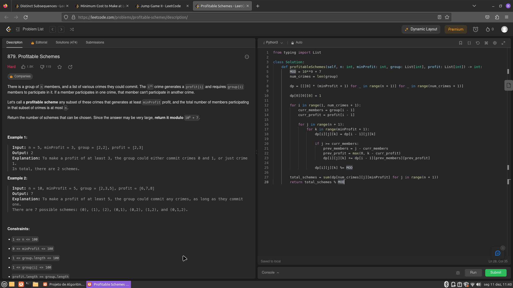

## Programação Dinâmica Exercicios Juiz Online
 
- Número na Lista : 33  
- Conteúdo da Disciplina: Programção Dinâmica  

## Alunos
|Matrícula | Aluno |
| -- | -- |
| 19/0142421  |  Artur Vinicius Dias Nunes |

## Sobre 
Exercicios resolvidos de juizes onlines LeetCode, sobre o tema programação de dinâmica.

[Distinct_Subsequences](https://leetcode.com/problems/distinct-subsequences/description/)  
[Jump_Game_2](https://leetcode.com/problems/jump-game-ii/description/) 
[Minimum_Cost_to_Make_at_Least_One_Valid_Path_in_a_Grid](https://leetcode.com/problems/minimum-cost-to-make-at-least-one-valid-path-in-a-grid/description/)  
[Profitable_Schemes](https://leetcode.com/problems/profitable-schemes/description/) 

## Screenshots

## Instalação 
**Linguagem**: Python 

## Uso 
Para executar os programas, basta baixar os códigos e submetê-los em um compilador online ou em um editor de código-fonte.

## Vídeos

https://github.com/projeto-de-algoritmos/PD_Exercicios_Juiz_Online/assets/58870950/e963fb8f-5039-4c17-adf0-4e112a2c082d
